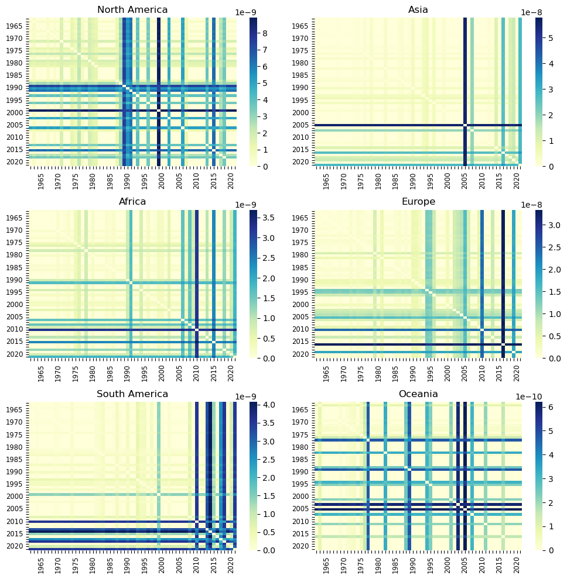

# Change-Point Detection of International Trade Crises using GraphML Methods

Trade linkages serve as important factors supporting the spillover effect in the transmission of economic impacts from one country to another. The recent increase in globalization has amplified the opportunities for spillover effects to occur, particularly during periods of significant macroeconomic upheaval such as financial crises, trade agreements, and geopolitical events. Prior literature has investigated various dimensions of spillover effects, including their magnitude, channels of propagation, and implications for economic policy; however, many have been limited to specific years, events, and countries. This work aims to instead examine the evolving scope of these spillover effects within the entire international trade network over the last 70 years, through the novel application of a graph similarity change-point detection method. With this method, pairs of graphs are first encoded with the same weights using a Siamese Graph Encoder. The siamese Graph Neural Network (sGNN) then learns a similarity function which classifies this pair of feature vectors as containing a change-point or not. Unlike other change-point detection methods, the node attributes and edge weights can be incorporated, providing essential information about the network dynamics. Additionally, a similarity metric does not have to be explicitly chosen, preventing loss of certain areas of information. I aim to analyze the identified change-points across different regions and product categories to discern potential variations in the influence of trade-related events and how these have changed over time, offering deeper insights into the relationship between spillover effects and the trajectory of globalization. By evaluating the differential impacts on geographic regions and consumption areas, this study can enhance our understanding of the intricate dynamics underlying global trade patterns and their susceptibility to external shocks.

