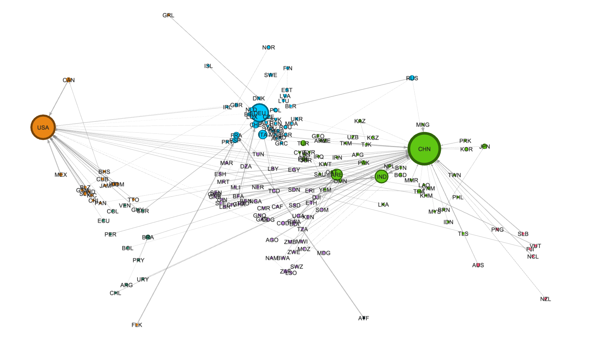

# Change-Point Detection of International Trade Crises using GraphML Methods

Trade linkages are important factors supporting the transmission of economic shocks from one country to another. Yet, how these events manifest themselves through import and export values can be ambiguous. The direction often depends on the magnitude of specific circumstances within a crisis, such as devaluation of domestic currency vs. weakened export capability. This work aims to understand these symptoms of financial crises, geopolitical events, and trade agreements through the novel application of a graph similarity change-point detection method to the international trade network. With this method pairs of graphs are first encoded with the same weights using a siamese graph encoder. The siamese graph neural network (sGNN) then learns a similarity function which classifies this pair of feature vectors as containing a change-point or not. Unlike other change-point detection methods, the node attributes and edge weights can be incorporated, providing essential information about the network. Additionally, a similarity metric does not have to be explicitly chosen, preventing loss of certain areas of information. Change-points identified for individual regions and categories of products will be analyzed to understand these crises’ differential impacts on certain geographic and consumption areas, providing greater clarity on the variable repercussions of these events.

